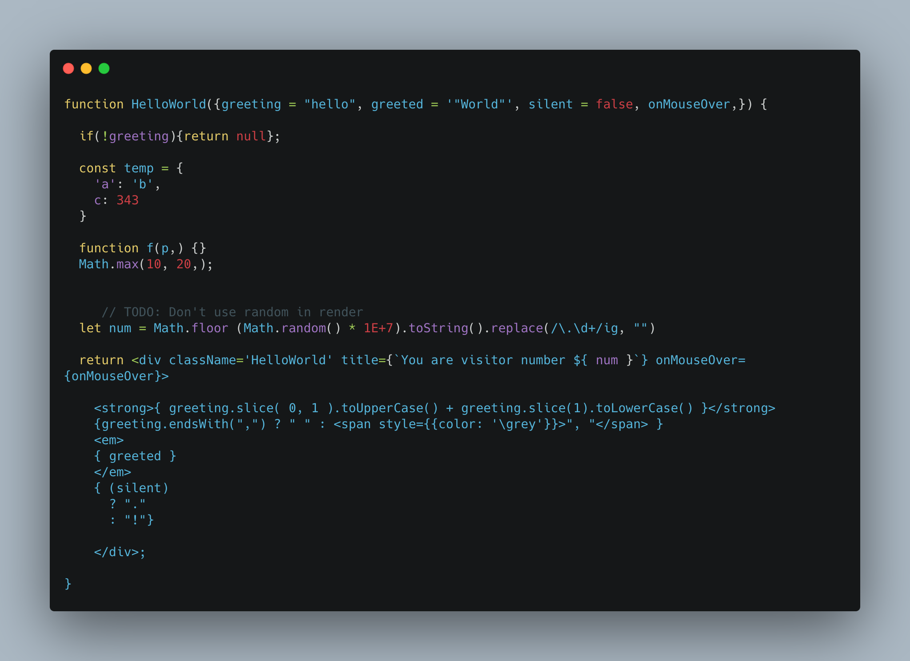
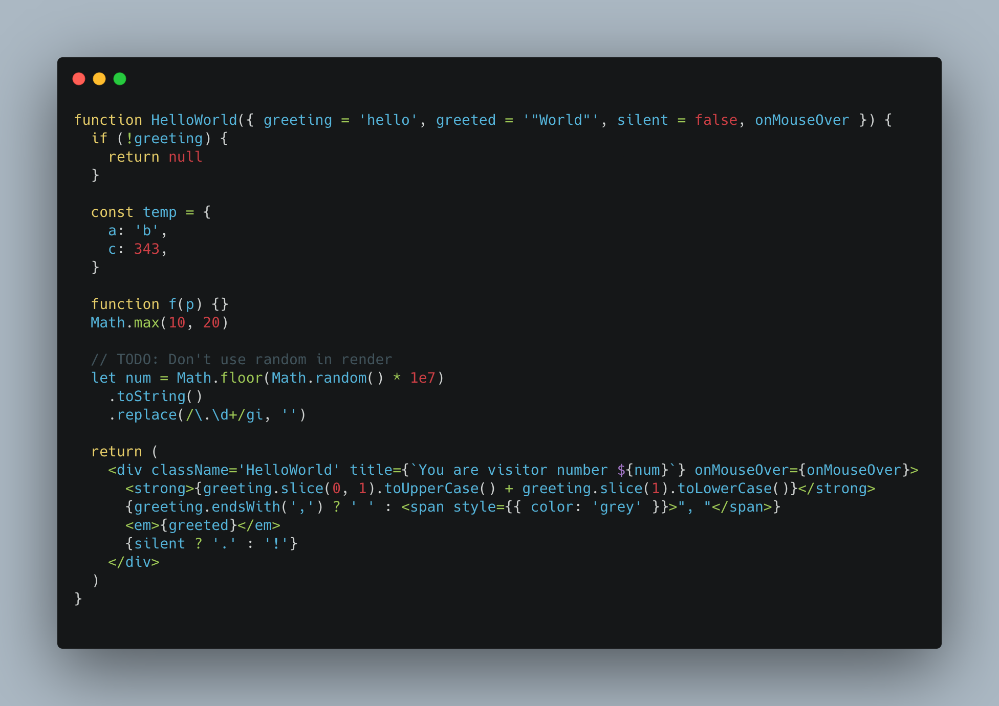

# @base/prettier-config

My shareable prettier config.


## Installation

Install  with npm

```bash
  npm install --save-dev @base/prettier-config
```

or with yarn

```bash
  yarn add --dev @base/prettier-config
```
## Usage

Reference @base/prettier-config in your package.json.


```javascript
{
  "name": "my-cool-library",
  "version": "9000.0.1",
  "prettier": "@base/prettier-config"
}

```


## Screenshots

Formatted before VS Formatted after





  
## License

[MIT](../../LICENSE)

  