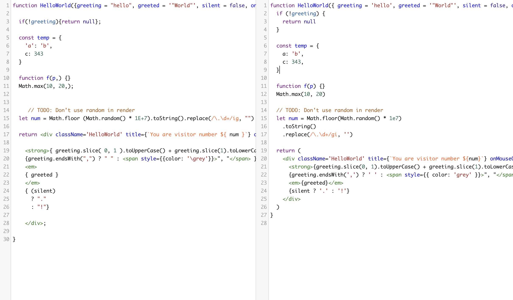

# @base/prettier-config

My shareable prettier config.


## Installation

Install  with npm

```bash
  npm install --save-dev @base/prettier-config
```

or with yarn

```bash
  yarn add --dev @base/prettier-config
```
## Usage

Reference @base/prettier-config in your package.json.


```javascript
{
  "name": "my-cool-library",
  "version": "9000.0.1",
  "prettier": "@base/prettier-config"
}

```


## Screenshots

[Formatted before VS Formatted after](https://prettier.io/playground/#N4Igxg9gdgLgprEAuEAzArlMMCW0AEAEnADYkQDqEATiQCYAUwA5tXHLlM-gLz4A6IABalyggDT5W7eHV74A5IKq06ghZIDOOEghjzUAQxKa4k6AFkI6UwHkAbnGriAvgEp8wflG-58OVAYAQmkOHC43YDYYdGoofCh0MhcAbl8BePxIKE19eABbAAd5L0y-BUMFJEUAIw10vzBqgGYAFmb0l3T0jCxcAkDC8Q9gLsyLQxghADp8wwAPBgBGAAZJACY1tzSfXb99gHoD-AAVWwARW2rz6AV9Gzh8akMoOgh8-3i2V6d03X1Eh8+BMptNUOQaPgGCCZs9Xu8GB4AFT4JYAUQA1AB2NzTGAQADKMGo4WYiOmbEKJEMYDgDAO-H400ZdAxBxwzEkgkEbm86WisXiAB46Dh7FlqZpNAA5Qz5OA8BTEMiUGj0BT4XAwXQ8YAAAwAmtZ8IY2Ph7DhtPjqAl0Pkak58AASYC2j4uPUufCWax2RzUXU+h4OJwuAB8fLK+CFuWo0GYYddoU4zGmmhIOFpDHwa1R+Fx+IAqoVCk4AMKGUyI-AYqRsMJcNMZrNLAsQAAyEAA7uXK3SPC4hQdY-GI1GWPWU9MEHRNBQcFMGBIefgAPwCEAb-DVGOFF74XIATx1wGAkHI1GqSn40kPChc4YkG6Hmj3UDD+DG+2jcHyY-4MBJpOcByGMAFDr+Y7fq6DDaLosC8lGfjroIzIgA0+zVIIQSCGBUZDqK9hhjs3guCA4ggBAhT9DkyCgKacZdgACqaCCaMgICGPYEA4HQ5EgDUzxgAA1hwBJ7mApLIMS6BmCAv4OnQdAge2LzMOghjMHAABiNBzDAKYcYY6D4vxQgwPkJAUEIC5wK+NJwASbELmKC6HhxYBSvx4SmNQMBMc8zBzMgRgmHJABWmjzAAQkJokwAScpwO24RwCFximBRkXzASpK6AAiugEDwNJ1CyRRe7UL5HE1IYDokPxhQkrA850FMyCrGsIBNRApgUM8hQcU1dlOI4-EAI5FfAAVUexKCVgAtFA7DKXxFFsJNOBsAFmnBUgoWZSApj5Dg6VhRR2hcAVU1pUgMlyTAdWte1SDrBRxKGDopJlu8e2cWQ-EPCcdVzQdcn2LJACSPywASYAktRACCrxEset1gw+QA)




  
## License

[MIT](../../LICENSE)

  